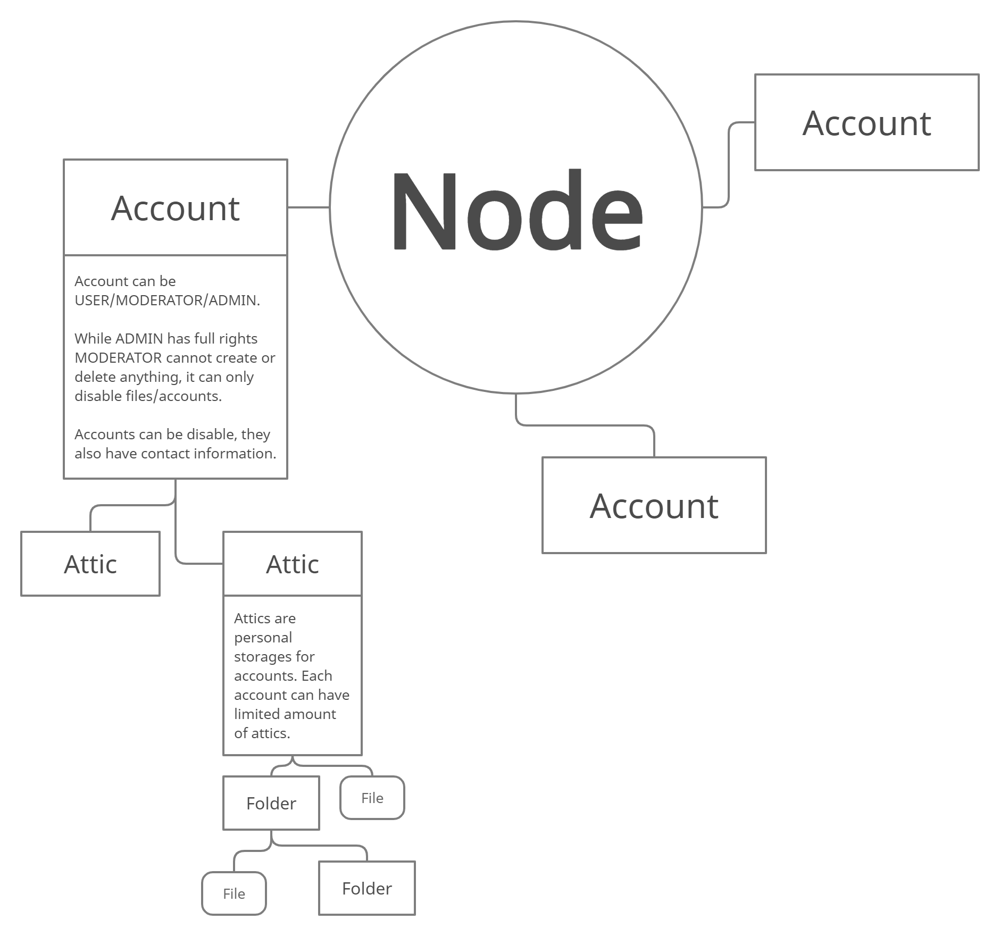

# Attic-API
Cloud storage solution for you!

## Quick Start
1. Setup MySQL server, open config/config.php and change settings according to your database server.
2. Run attic.sql, it will generate MySQL server with tables and procedures.
3. Setup apache server or alternatives.
4. You are ready to use API functions!

## How it works

## [Documentation](https://github.com/artak10t/Attic-API/wiki)
